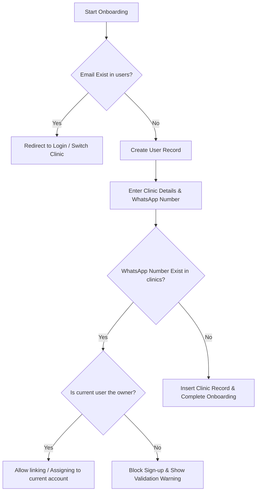

# Multi-Clinic Database Architecture & Data Redundancy Resolution

This document outlines the database refactoring, onboarding logic, and webhook routing strategies required to support dentists owning multiple clinics while preventing data redundancy and conflict issues.

---

## 1. Relational Database Schema Design (Supabase PostgreSQL)

Currently, the `dentists` table represents both the user account and the clinic context. To support multi-clinic users, we separate this into a one-to-many relationship.

### `users` Table
Stores login credentials, core profile, and authorization details.

```sql
CREATE TABLE users (
    id UUID PRIMARY KEY DEFAULT gen_random_uuid(),
    email VARCHAR(255) UNIQUE NOT NULL,
    password_hash VARCHAR(255) NOT NULL,
    name VARCHAR(255) NOT NULL, -- Doctor's Name
    created_at TIMESTAMPTZ DEFAULT NOW(),
    updated_at TIMESTAMPTZ DEFAULT NOW()
);
```

### `clinics` Table
Stores operational settings, credentials, operating hours, and AI settings for each physical location.

```sql
CREATE TABLE clinics (
    id UUID PRIMARY KEY DEFAULT gen_random_uuid(),
    owner_id UUID NOT NULL REFERENCES users(id) ON DELETE CASCADE,
    clinic_name VARCHAR(255) NOT NULL,
    clinic_address TEXT NOT NULL,
    working_hours JSONB NOT NULL DEFAULT '{}'::jsonb,
    whatsapp_number VARCHAR(50) UNIQUE NOT NULL, -- Enforces unique phone number per clinic
    google_calendar_token JSONB DEFAULT '{}'::jsonb,
    google_calendar_id VARCHAR(255) DEFAULT 'primary',
    subscription_status VARCHAR(50) DEFAULT 'trial',
    trial_ends_at TIMESTAMPTZ,
    slack_webhook TEXT,
    slack_notification_mode VARCHAR(50),
    created_at TIMESTAMPTZ DEFAULT NOW(),
    updated_at TIMESTAMPTZ DEFAULT NOW()
);
```

---

## 2. Onboarding & Registration Validation Flow

To prevent a doctor from registering twice with the same WhatsApp number or creating redundant accounts:



### Verification SQL Query during Onboarding:
```sql
-- Check if WhatsApp number is already registered to another owner
SELECT owner_id, clinic_name 
FROM clinics 
WHERE whatsapp_number = :entered_number;
```

---

## 3. Webhook Message Routing Logic

When an incoming WhatsApp message is received, the router fetches the corresponding clinic location configuration based on the unique `whatsapp_number` field.

```javascript
// routes/whatsapp.js (Updated Routing flow)
router.post("/webhook", async (req, res) => {
    const from = req.body.From.replace("whatsapp:", ""); // Patient Phone
    const to = req.body.To.replace("whatsapp:", "");     // Clinic WhatsApp Number

    try {
        // Retrieve target clinic configuration using the UNIQUE WhatsApp number mapping
        const { data: clinic, error } = await supabase
            .from("clinics")
            .select("*, owner:users(name)")
            .eq("whatsapp_number", to)
            .single();

        if (error || !clinic) {
            console.error(`[WhatsApp] Clinic not found for number: ${to}`);
            return res.status(200).send("OK"); // Avoid retries from webhook provider
        }

        // Process message utilizing specific clinic brain (RAG context, calendar, settings)
        const aiResponse = await processMessage(clinic, from, req.body.Body);

        // Send reply to patient
        await sendWhatsAppMessage(from, aiResponse.message);
        res.status(200).send("OK");
    } catch (err) {
        console.error("[WhatsApp Routing Error]", err.message);
        res.status(200).send("OK");
    }
});
```

in the sign up form ask "How many clinics do you want to register?" there must be a dropdown with values 1 to 5
case 1: 1 clinic
then no worries ask them their details. their name, clinics name, email id. here the primary differentiator is the email id they entered in the form it should not match any other email int he database.
case 2: more than one clinic.
if they select more than 1 then the email id is not the differentiator the address is the differentiator the address must not be same for any of the clinics in the database . it should ask details of all clinics in one d=single from maybe in different pages but it should be submitted at once.


if the dentist